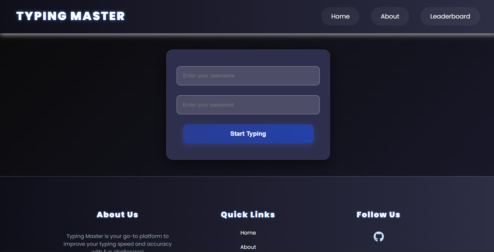
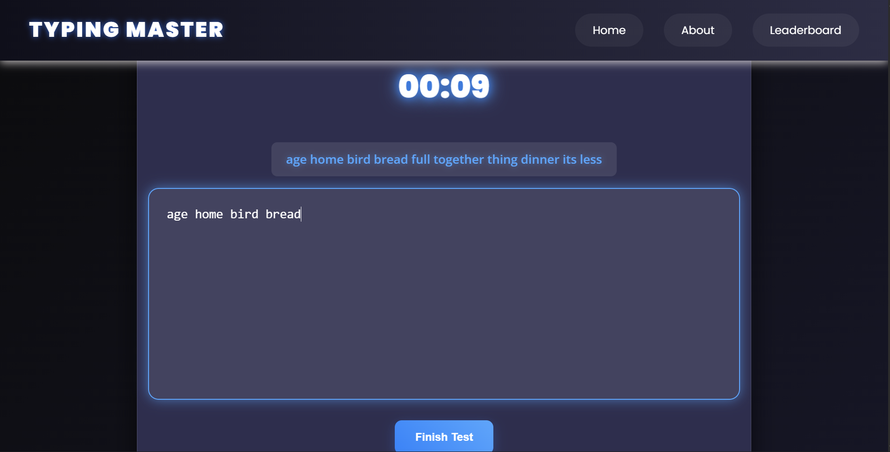
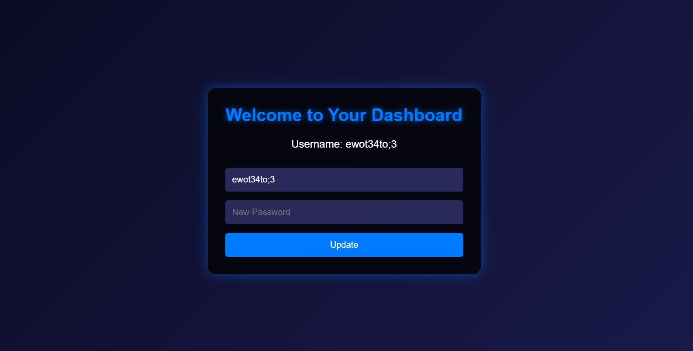

# Test Type

**Test Type** is a small project to check your **typing speed and accuracy**.  
It shows you how many words per minute (WPM) you can type and how correct your typing is.  

---

## 🚀 Features
- Start and stop typing test  
- Show words per minute (WPM)  
- Show characters per minute (CPM)  
- Show typing accuracy (%)  
- Simple and clean design  
- Save and show results (with PHP + MySQL)  

---

## 🛠️ Technologies
- **HTML** → page structure  
- **CSS** → styles and design  
- **JavaScript** → typing logic and timer  
- **PHP** → backend and data management  
- **MySQL** → store results  

---

## 📦 How to Run
1. Clone this project:  
   ```bash
   git clone # Test Type

**Test Type** is a small project to check your **typing speed and accuracy**.  
It shows you how many words per minute (WPM) you can type and how correct your typing is.  

---

## 🚀 Features
- Start and stop typing test  
- Show words per minute (WPM)  
- Show characters per minute (CPM)  
- Show typing accuracy (%)  
- Simple and clean design  
- Save and show results (with PHP + MySQL)  

---

## 🛠️ Technologies
- **HTML** → page structure  
- **CSS** → styles and design  
- **JavaScript** → typing logic and timer  
- **PHP** → backend and data management  
- **MySQL** → store results  

---

## 📦 How to Run
1. Clone this project:  

   git clone https://github.com/username/test-type.git

2. Put the project folder inside your htdocs (XAMPP).

3. Import the database using query.txt.

4. Open in your browser:

http://localhost/index.php


5. Login and start typing





